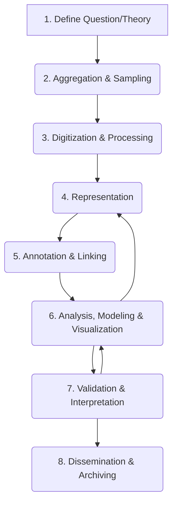

<p align="center">
  <a href="https://github.com/Computational-Ethnography-Lab" target="_blank">
    
  </a>
</p>    

# Computational Analysis for Qualitative Data: Workflow and Visualization Resources

This repository provides an overview, workflow summaries, and practical resources for integrating computational text analysis—primarily using Python—with qualitative and historical research methods.  

It covers tools and approaches ranging from basic data organization and visualization to advanced machine learning integration, emphasizing a [pragmatic approach](https://arxiv.org/abs/2509.12503) to social science research.  

The repository is a work in progress, designed to support learning. It is in its early stages, so please send resources or thoughts (but not hate-mail) to corey.abramson@rice.edu. 

### A Few Key Links
[Visualization Toolkit (collab version)](https://tinyurl.com/cmapoctober5)  
[Lab home - links to everything](https://github.com/Computational-Ethnography-Lab )  
R to python cheat sheets, not mine but useful!: [1](https://github.com/SrihariPramod/R_vs_Python_Cheatsheet/blob/master/R_vs_Python.pdf), [2](https://datascientyst.com/pandas-vs-r-cheat-sheet/#6-pandas-vs-r-comparison)  

### Author/Instructor/Curator
**Corey M. Abramson, Ph.D.** 

Associate Professor of Sociology, [Rice University](https://profiles.rice.edu/faculty/corey-m-abramson)  
PI, Computational Ethnography Lab, [GitHub](https://github.com/Computational-Ethnography-Lab/)  
Co-Director, [Center for Computational Insights on Inequality and Society (CIISR)](https://ciisr.rice.edu/)  
Core Faculty, [Medical Cultures Lab, UC San Francisco](https://www.cultureofmedicine.org/about/team)  
Affiliated Faculty, [Center for Ethnographic Research, UC Berkeley](https://issi.berkeley.edu/cer/people) 
Affiliated Faculty, [Institute of Health Resilience and Innovation, Rice]( https://ihri.rice.edu/) 
Affiliated Faculty, [Ken Kennedy Institute, Responsible AI and Computing, Rice](https://kenkennedy.rice.edu/people-affiliates) 

**Sociology**: stratification and inequality, health and medicine, culture, aging, networks, methodology (qualitative, computational and mixed methods), theory  
**Health policy**: aging, alzheimer's disease and related dementias, social determinants of health, decision making, end of life, methodology (mixed-methods, big "qual" data)  

<div align="center">
  
  <p><em>"Sunday": A photo from Professor Abramson’s fieldwork.</em></p>
</div>


**Key Goals:**

> - **Introduce computational tools for analyzing text.**
> - **Facilitate social-scientific analyses for varied projects.**
> - **Allow combining pattern-finding with deep reading of qualitative information.**
> - **Keep links from patterns and models, back to original context (quotes, fieldnotes, transcripts).**
> - **Prioritize transparency, accuracy, and human insight alongside purposeful technology use (study design, analysis, validation, de-ID, open sourcing).**
> - **Introduce flexible visualization options usable across projects and data types**
See: [Computational Ethnography Lab (CEL) Home](https://computationalethnography.org/) for more background and tools 

<p>In addition to checking out this page and the GitHub repo, you might also find the following useful background:</p>
<ul>
    <li>This very useful video by Rice grad Jakira Silas introducing how to use the toolkit in google collab (<a class="inline_disabled" href="https://vimeo.com/1122226315" target="_blank" rel="noopener">link</a>). # Highly recommended if you have not used python/jupyter/google colab before.</li>
    <li>This pre-print on combinations of qualitative and computational social science, which also has very detailed workflow (<a class="inline_disabled" href="https://osf.io/preprints/socarxiv/7bsgy_v1" target="_blank" rel="noopener">link</a>)</li>
    <li>This pre-print which discusses data formatting and processing in detail, focused on field methods and making interviews/fieldnotes usable for computational analysis (<a class="inline_disabled" href="https://osf.io/preprints/osf/jvpbw_v1" target="_blank" rel="noopener">link</a>)</li>
    <li><span style="font-family: inherit; font-size: 1rem;">This introduction to machine learning for qualitative research, focused on scaling <a class="inline_disabled" href="https://cmabramson.com/resources/f/qualitative-coding-simplified" target="_blank" rel="noopener">coding</a> (e.g. adding information like #morality_talk to annotate text), and some related aspects of workflow using interviews (from ASA 2022) (l<a class="inline_disabled" href="https://colab.research.google.com/drive/1qMwvjaY6DKQ-jxFTyXt3S3qNQdpV_S9n?usp=sharing" target="_blank" rel="noopener">ink</a>)</span></li>
</ul>

## Table of Contents

*   [I. General Premise: A Pragmatic Mixed-Methods Approach](#i-general-premise-a-pragmatic-mixed-methods-approach)
    *   [The Pragmatic Approach](#the-pragmatic-approach)
    *   [Key Strategies and Frameworks](#key-strategies-and-frameworks)
    *   [Computational Ethnography and Broader Applications](#computational-ethnography-and-broader-applications)
*   [II. Core Workflow and Components](#ii-core-workflow-and-components)
    *   [Workflow Steps (End-to-End)](#workflow-steps-end-to-end)
    *   [Data Schema Example (CMAP)](#data-schema-example-cmap)
    *   [Modes of Combining Computation and Qualitative Analysis](#modes-of-combining-computation-and-qualitative-analysis)
*   [III. Python Toolkits and Resources](#iii-python-toolkits-and-resources)
    *   [Visualization: The CMAP Toolkit](#visualization-the-cmap-toolkit)
    *   [Machine Learning and NLP Tutorials](#machine-learning-and-nlp-tutorials)
    *   [Core Python Stacks & Docs](#core-python-stacks--docs)
    *   [Data Visualization Resources (Sociology + Practice)](#data-visualization-resources-sociology--practice)
    *   [De-identification (NIH/HHS & Open Tools)](#de-identification-nihhhs--open-tools)
    *   [Conceptual Guides, Blogs, and How-Tos](#conceptual-guides-blogs-and-how-tos)
    *   [CAQDAS & Exporting QDA for Python](#caqdas--exporting-qda-for-python)
*   [IV. Glossary (Selected)](#iv-glossary-selected)
*   [V. Bibliography (ASA Style, by Topic)](#v-bibliography-asa-style-by-topic)
    *   [Frameworks, Pragmatic Approaches, and Mixed Methods](#frameworks-pragmatic-approaches-and-mixed-methods)
    *   [Comparative Methods and Research Design](#comparative-methods-and-research-design)
    *   [Computational Ethnography and Hybrid Approaches](#computational-ethnography-and-hybrid-approaches)
    *   [Computational Social Science (CSS) and Text Analysis Methods](#computational-social-science-css-and-text-analysis-methods)
    *   [Culture, Meaning-Space, and Historical Methods](#culture-meaning-space-and-historical-methods)
    *   [Data Visualization and Tools](#data-visualization-and-tools)
    *   [Ethics, De-identification, and Sharing](#ethics-de-identification-and-sharing)

---

## I. General Premise: A Pragmatic Mixed-Methods Approach

### The Pragmatic Approach

The foundation of this overview is a _pragmatic approach_ to computational tools (computational text analysis, and AI, ML, NLP tools). This perspective emphasizes using computation in service of sociological aims (empirical explanation, theory-guided measurement, comparative design, evidence-based recommendations), rather than as an end in itself. In this approach, the research question should determine the methodology.

This approach builds on long traditions in the social sciences that utilize multi-method approaches, triangulation, and pragmatic inquiry to connect different levels of analysis and generate insights on topics of scientific and practical importance (e.g., Du Bois 1899; Small 2011; Lamont and White 2008; Abramson et al. 2018).

Computational tools are used here to expand human inquiry, reasoning and  analysis. This is consistent with prior technology like statistical computing, qualitative data analysis (QDA) software and data visualization going back decades (Dohan and Sánchez-Jankowski 1998). It also recognizes, computation is already embedded in modern research and daily life—from CAQDAS software to search algorithms—and leveraging these technologies thoughtfully for imaginative social inquiry can aid both social science, and ensure emergent technologies can be used in ways that contribute to understanding pressing social issues (Abramson 2024).

Yet, even if you don't agree, knowing more about these tools and their logics-- particularly as their reach expands-- provides insights into changing fields. 

Much of this uses python, as it is a free open-source programing language that is both extremely flexible, and adaptable for computational text analysis, machine learning, and visualization (alongside statistics and myriad other applications). There are also links to R, for stats and data visualization. Both languages are important in computational social science work.

### Key Strategies and Frameworks
Qualitative data, is information-- often produced via in-depth methods such as participant observation, in -depth interviews, and historical analyses-- that was generated or collected with the intent of not being  reducible to numeric form alone (Abramson et  al. 2025). 

Analyzing qualitative data computationally, without reduction to numbers alone, can take various forms depending on the research paradigm, ethnographic tradition or approach to combining methods:
*   **Computational Ethnography:** is one  approach that uses a pragmatic mixed methods approach.
> CE combines in-depth analysis of text data produced in  qualitative research—such as ethnographic field notes, interview transcripts, historical documents, or web posts—with tools for pattern analysis and visualization. This approach maintains a focus on situating meaning and behavior in real-world contexts, while integrating tools from computational social science (CSS) to identify and verify patterns (and engage with alternatives and counterfactuals).
> A core focus is empirically connecting levels of analysis—alternating between aggregate patterns and granular details— like connecting 'maps' and 'street views'-- in a map program on your phone to get a more hollistic picture of geography. Sociologically, this has precedent in work to link [biography and history](https://contexts.org/blog/soc-ai/), chart [dualities](https://www.rsfjournal.org/content/10/5/34), link [objective structures and subjectivity](https://www.hup.harvard.edu/books/9780674212770)-- while maintaining the contextual depth and precision of systematic qualitative work (Abramson et al. 2018; Li and Abramson 2025).

*   **The Text as Data Framework:** A structured approach common in Computational Social Science (CSS) that iterates between **Representation → Discovery → Measurement → Prediction → Causal Inference** (Grimmer, Roberts & Stewart 2022). This helps define the *Quantity of Interest* (QoI) and emphasizes validation (Grimmer and Stewart 2013).
*   **Scaling Up ↔ Scaling Down**: A mixed-methods strategy of using models to map the terrain and identify aggregate patterns (Scaling Up), and then returning to close reading for interpretation and contextual depth (Scaling Down) (Breiger 2015). This emphasizes the necessity of human validation when interpreting models (Chang et al. 2009, "Reading Tea Leaves"). This is seen in both deep readings of big data, and growing large-scale qualitative studies that combine systematic sampling to facilitate broader reach, subsets, and comparison. 
*   **Computational Grounded Theory (CGT):** An inductive approach utilizing an iterative loop between human theorizing and computational pattern detection, often starting with unsupervised methods meant to generate insights from data first (Nelson 2020).
*   **Hybrid Approaches (e.g., HHMLA):** Integrating automation (e.g., lists, machine learning) with human coding, depending on the scope and complexity of the task. This involves managing tradeoffs: while accuracy is key for a realist approach, time efficiency and identifying insights otherwise missed are also crucial considerations (Li, Dohan, and Abramson 2021).
*   **Comparative Design:** Applying principles from comparative research design for meaningful contrasts across sites, times, or groups. This involves careful attention to the logics of comparison and the challenges of cross-contextual analysis (Dohan and Sánchez-Jankowski 1998; Gong and Abramson 2020; Abramson and Gong 2020).
*   **Relational Analysis of Meaning:** Applying formal network methods and visualization to understand the duality of culture and practice, often used in historical analysis (Mohr and Duquenne 1997).
*   **Extended Computational Case Method:** An approach combining the logic of the extended case method with computational techniques to reconstruct and analyze social fields (Pardo-Guerra et al. 2022).

### Computational Ethnography and Broader Applications
Many tools are included here because they have been useful for work in [**Computational Ethnography**](https://computationalethnography.org/) or large-scale qualitative analysis.

However, the principles and tools presented here are broadly applicable. They have been used across diverse research paradigms and use cases, including academic research, community organizing, quantitative social science, studies of temporality and health policy, and scientific as well as humanistic applications. The methods linked employ established visualization techniques (e.g., heatmaps, semantic networks) and mixed-methods strategies suitable for analyzing any form of text data, including non-human subjects data (e.g., policy documents, organizational records, webscraped content). They do not require believing the same things or having the same goal as the author.

[Return to Table of Contents](#table-of-contents)

---

## II. Core Workflow and Components

### Workflow Steps (End-to-End)

The workflow for analyzing text as data is iterative. This synthesized workflow integrates pragmatic qualitative steps (Abramson et al. 2025; Li and Abramson 2025) with frameworks established in CSS (Grimmer et al. 2022).



1.  **Define Question/Theory**
      * Specify the research question or *Quantity of Interest* (QoI). Work may begin inductively (Nelson 2020) or deductively (Abramson et al. 2018; Grimmer et al. 2022).
2.  **Aggregation (Building the Corpus)**
      * Define population, sampling frame, and document units. Data sources can include transcribed interviews, ethnographic fieldnotes, historical documents, webscraped data, policy documents, administrative text, or open-ended survey responses. Record provenance and metadata.
      * *Python Tools:* `pandas` for manifests; `requests` + `beautifulsoup4` (web scraping), or API clients. Store as JSONL/CSV + raw text.
      * [Export](https://cmabramson.com/resources/f/sub-setting-qualitative-data-for-machine-learning) from QDA software, or integrate text into a data frame 
3.  **Digitization and Processing (Data Wrangling)**
      * *Digitization (OCR & QA):* Convert PDFs/scans. Perform manual Quality Assurance (QA). Choose digitization to preserve meaningful structure (speaker turns, page breaks) for citation integrity.
      * *Processing:* Clean and format text into machine-readable and tabular formats (see [Schema](#data-schema-example-cmap) below). Data can be imported from QDA software or read directly from `.txt` (UTF-8) files. Tokenize/segment and normalize.
      * *Python Tools:* `pytesseract` (OCR); `spaCy` (normalization/tokenization).
4.  **Representation**
      * Transform text into formats suitable for computational analysis.
      * Choose representations (BOW/TF-IDF, dictionaries, embeddings) to fit the QoI. This involves visualizing patterns, combined with readings.
      * *Python Tools:* `scikit-learn` vectorizers (DTM/TF-IDF); Hugging Face `transformers` (Embeddings).
5.  **Annotating and Linking**
      * *Annotating:* Build human system for indexing data. For instance, utilize a hybrid approach—combining automation (lists, machine learning) and human coding depending on scope and complexity (Abramson et al. 2025). This involves managing tradeoffs: while accuracy is key for a realist approach, time efficiency and identifying insights otherwise missed are also crucial considerations (Li et al. 2021).
      * *Entity tagging*: (persons/orgs/places) via `spaCy` NER.
      * *Linking:* Join texts to variables in dataframe (site, time, treatment, demographics) for comparison and modeling. If useing qualitative software, or purposeful file naming, this can be done with minimal work (Li and ABramson 2025)[https://arxiv.org/pdf/2412.06087] 
      * *Python Tools:* `spaCy` NER; `pandas` (linking).
6.  **Analysis, Modeling & Visualization**
      * *Descriptions & Visualization:* LDA topics + human validation ("Reading Tea Leaves"); word-embeddings // cite boutlyine and Abramson et al. AVP pain paper  https://www.rsfjournal.org/content/rsfjss/10/5/34.full.pdf . Use visualization tools (e.g., CMAP) to explore patterns and comparisons (Abramson and Dohan 2015).
      * *Modeling:* Supervised coding/stance with `scikit-learn` baselines and transformers (BERT-class); report metrics, calibration, and error analysis. Combine unsupervised exploration (topics/clusters) with supervised measurement/prediction.
      * *Deep Reading & Interpretation:* Always return to exemplar passages to contextualize model patterns (scale down), examine disconfirming cases, update explanations to account for data while noting contextual limits.
7.  **Dissemination and Archiving**
      * Reproducible Jupyter notebooks (see [workshop repo](#machine-learning-and-nlp-tutorials)), [CMAP visualizations](#visualization-the-cmap-toolkit), codebooks, curated quotes. Pair patterns + passages in presentation. Archive code/data where allowed; follow [de-identification guidance](#de-identification-nihhhs--open-tools) and document limits/ethics.

### Data Schema Example (CMAP)

For structured analysis and visualization (e.g., using the CMAP toolkit), data should be organized into a consistent tabular format (e.g., CSV or DataFrame). Below is an example schema:

```python
# Updated schema with Python typing
schema = {
    "project": str,          # List project
    "number": str,           # Position information
    "reference": int,        # Position information
    "text": str,             # Content, critical field: must not be empty
    "document": str,         # Data source, Critical field: must not be empty
    "old_codes": list[str],  # Optional: codings, must be a list of strings
    "start_position": int,   # Position information
    "end_position": int,     # Position information
    "data_group": list[str], # Optional, to differentiate document sets: Must be a list of strings
    "text_length": int,      # Optional: NLP info
    "word_count": int,       # Optional: NLP info
    "doc_id": str,           # Optional: NLP info, unique paragraph level identifier
    "codes": list[str]       # Critical for analyses with codes, Must be a list of strings
}
```

### Modes of Combining Computation and Qualitative Analysis

A key consideration is *how*—or *whether*—to integrate computational tools into the analytical workflow. Researchers adopt different modes based on project needs, data sensitivity, and analytical goals (Abramson et al. 2025).

1.  **Streamline (Organizational):**
      * Using computational tools to manage the logistics of research—organizing manifests, facilitating de-identification, managing quotes, and tracking team progress—even if the core coding and analysis remain entirely manual.
2.  **Scale-up (Efficiency/Scope):**
      * When the corpus is large, longitudinal, or multi-site, machine learning (e.g., supervised classification) is used to assist human coding. This requires high-quality human-labeled training data and rigorous human checks and validation (e.g., hybrid approaches).
3.  **Hybrid (Iterative Refinement and Mixed Methods):**
      * Interleaving human analysis with computational methods to answer different types of questions or refine understanding. This can involve iterative coding refinement (Li et al. 2021), or using computational patterns (e.g., visualization, network analysis) to identify typologies or variations that guide subsequent in-depth reading and comparison (Abramson et al. 2025).
4.  **Discovery (Pattern Finding):**
      * Utilizing unsupervised methods (e.g., topic modeling, clustering, visualization) to identify latent patterns, themes, or typologies that guide subsequent deep reading and theory development (Nelson 2020).
5.  **Minimal/No Computation (The "Sociology of Computation"):**
      * Deliberately choosing *not* to automate analysis when ethical considerations, highly specific contexts, small scale, or the nature of the inquiry make automation counterproductive or risky. Documenting the rationale for this choice is practical, given review-- explaining reflexivity and decisions has long been central to qualitative inquiry (Abramson et al. 2025;).

[Return to Table of Contents](#table-of-contents)

---

## III. Python Toolkits and Resources

This section highlights Python-based resources developed for mixed-methods analysis, alongside general CSS tools, visualization guides, and conceptual resources.

### Visualization: The CMAP Toolkit

Visualization is powerful for exploring data, representing patterns, connecting levels of analysis, and testing emerging typologies, and facilitating comparison with various data types (Healy and Moody 2014; Abramson and Dohan 2015).

The **CMAP (Cultural Mapping and Pattern Analysis) Visualization Toolkit** is an open-source suite of tools produced by the [Computational Ethnography Lab](https://github.com/Computational-Ethnography-Lab) (CEL) to analyze and visualize text data (fieldnotes, interviews, historical documents, etc.). It is designed for qualitative researchers interested in the pattern analysis and visualization possibilities of CSS (CMAP Notebook 2025).

*   **GitHub Repo (Offline/Full Version):** [https://github.com/Computational-Ethnography-Lab/cmap\_visualization\_toolkit](https://github.com/Computational-Ethnography-Lab/cmap_visualization_toolkit)
    *   *Note: The offline version can be run securely and locally, without sharing data.*
*   **Teaching Version (Google Colab):** [Link to Notebook](https://colab.research.google.com/github/Computational-Ethnography-Lab/cmap_visualization_toolkit/blob/main/cmap_toolkit_teaching_0_9_4b.ipynb)
    *   *Note: The Colab version is suitable for public data but relies on cloud computing.*
*   **Citation:** Abramson, Corey M. and Yuhan (Victoria) Nian. 2025. *CMAP Visualization Toolkit*. [https://doi.org/10.5281/zenodo.17162829](https://doi.org/10.5281/zenodo.17162829).

**Capabilities:**
The toolkit supports granular analysis mirroring qualitative practices (at the level of words, sentences, paragraphs), yet is scalable for large datasets. It utilizes various analytic methods, including co-occurrences, several clustering methodologies (e.g., Cosine similarity, Jaccard, PMI, TF-IDF), and word embeddings (e.g., RoBERTa) approaches.

*   **Heatmaps:** Visualize patterned variation or code co-occurrence in a color code table, to represent people, events, codes, or text.
*   **Semantic Networks:** Visualize relationships between concepts or terms, within and across segments of your data.
*   **t-SNE/Dimensional Reduction:** Visualize semantic proximity between words or for document clustering, like a scatterplot with language.
*   **Word Clouds:** Visualize salient terms, making them larger. Simple and user friendly, supporting user-defined concept groups ("word families").


<div class="grid">
  <div class="grid-item">
    
    <div class="caption"><em>A heatmap visualizing patterned variation in interviews. (Source: CEL)</em></div>
  </div>
  <div class="grid-item">
    
    <div class="caption"><em>A semantic network of concepts in field notes and interviews. (Source: CEL)</em></div>
  </div>
  <div class="grid-item">
    
    <div class="caption"><em>A t-SNE plot for document clustering. (Source: CEL)</em></div>
  </div>
  <div class="grid-item">
    
    <div class="caption"><em>A word cloud with user-defined concept groups. (Source: CEL)</em></div>
  </div>

[Tutorial video](https://player.vimeo.com/video/1122226315?badge=0&amp;autopause=0&amp)

### Machine Learning and NLP Tutorials

*   **ASA 2022 Workshop — Intro to ML for Qualitative Research (w/Zhuofan Li), contains some python webscraping examples (with Li and Dohan):**
    *   [GitHub Repo](https://github.com/lizhuofan95/ASA2022_Workshop)
    *   *Content:* Jupyter notebook examples using Python analyzing public interview data. Covers workflow from preparation to model training (including BERT) and validation, to parallel (Li, Dohan and ABramson 2021).
*   **Python-focused CSS Introductions:**
    *   [GESIS CSS Methods Python](https://github.com/gesiscss/css_methods_python) (Notebooks introducing CSS methods using Python).
    *   [Awesome Computational Social Science](https://github.com/gesiscss/awesome-computational-social-science) (Curated list of resources).
*   **Code companions for *Text as Data*** (Grimmer et al. 2022):
    *   Ornstein’s Text-as-Data course site (R code companion): [Site](https://joeornstein.github.io/text-as-data/) | [Repo](https://github.com/joeornstein/maymester-text-as-data)
*   **General Computational Social Science “how-to’s”:**
    *   SICSS (Summer Institutes in Computational Social Science): [Main Site](https://sicss.io/) | [Curriculum](https://sicss.io/curriculum)
    *   Salganik, *Bit by Bit* (book site, open chapters): [https://www.bitbybitbook.com/](https://www.bitbybitbook.com/)

### Core Python Packages & Docs

These libraries form the backbone of many Python-based text analysis workflows (as utilized in the CMAP Toolkit).

*   **Data Handling & Math:**
    *   [**pandas**](https://pandas.pydata.org/) (Data wrangling, manifests, linking).
    *   [**NumPy**](https://numpy.org/) (Numerical operations, array handling).
    *   [**SciPy**](https://scipy.org/) (Scientific computing, statistics, clustering, distance metrics).
*   **Natural Language Processing (NLP):**
    *   [**spaCy**](https://spacy.io/) (Tokenization/NER/dependencies/preprocessing).
    *   [**NLTK**](https://www.nltk.org/) (Natural Language Toolkit - general NLP tasks, stopwords, stemming).
    *   [**gensim**](https://radimrehurek.com/gensim/) (LDA Topic modeling, word2vec/doc2vec- older, but low compute).
*   **Machine Learning and Embeddings:**
    *   [**scikit-learn**](https://scikit-learn.org/) (Vectorizers, traditional ML models, evaluation metrics, clustering).
    *   [**Hugging Face transformers**](https://huggingface.co/docs/transformers/index) (BERT-class models, embeddings, pipelines).
    *   [**Sentence-Transformers**](https://www.sbert.net/) (Easy methods for sentence, text, and image embeddings).
    *   [**PyTorch**](https://pytorch.org/) (Deep learning framework, consider docker containers for complex programs to manage dependencies //add link).
*   **Visualization:**
    *   [**Matplotlib**](https://matplotlib.org/) (Base plotting library).
    *   [**Seaborn**](https://seaborn.pydata.org/) (Statistical data visualization, heatmaps).
    *   [**Plotly**](https://plotly.com/python/) (Interactive visualizations).
    *   [**WordCloud**](https://github.com/amueller/word_cloud) (Generating word clouds).
    *   [**NetworkX**](https://networkx.org/) (Creation and study of complex networks).
*   **Utilities:**
    *   [**pytesseract**](https://pypi.org/project/pytesseract/) (OCR wrapper for [Tesseract engine](https://github.com/tesseract-ocr/tesseract)) OCR = Optical Character Recognition, for extracting text from images or .pdf files.  Not necessary for information already in text format.

### Data Visualization Resources

*   **Python Graphy Gallery:** [Charts by use, with code samples](https://python-graph-gallery.com/)
*   **Healy & Moody (2014):** ["Data Visualization in Sociology" (ARS)](https://www.annualreviews.org/content/journals/10.1146/annurev-soc-071312-145551). ([PDF mirror](https://kieranhealy.org/files/papers/data-visualization.pdf)).
*   **Healy, Kieran. (2018).** [*Data Visualization: A Practical Introduction*]([https://kieranhealy.org/dataviz/](https://kjhealy.github.io/socviz/)).
*   **Matplotlib Colormap Guidance:** [Choosing Colormaps in Matplotlib](https://matplotlib.org/stable/users/explain/colors/colormaps.html) 
*   **Python Data Science Handbook:** [Colorbars/colormaps primer](https://jakevdp.github.io/PythonDataScienceHandbook/04.07-customizing-colorbars.html).
*   **Historical Inspiration:** W.E.B. [Du Bois’s groundbreaking work](https://www.smithsonianmag.com/history/first-time-together-and-color-book-displays-web-du-bois-visionary-infographics-180970826/) using of visualization alongside fieldwork and surveys (Battle-Baptiste and Rusert 2018; Du Bois 1900). 
*   **Color Blind Templates:** [P. Tol](https://sronpersonalpages.nl/~pault/)
*   **Du Boisian Toolkit** [python, R, and more](https://www.dignityanddebt.org/projects/du-boisian-resources/) 

### De-identification (NIH/HHS & Open Tools)

Important for ethical dissemination and archiving of sensitive data (e.g., interviews, health information). 

*   **HHS HIPAA Guidance:** [Expert Determination & Safe Harbor](https://www.hhs.gov/hipaa/for-professionals/special-topics/de-identification/index.html).
*   **NLM Scrubber (NIH):** [Clinical text de-ID tool](https://lhncbc.nlm.nih.gov/scrubber/). (See Kayaalp et al. 2014; [Overview Article](https://pmc.ncbi.nlm.nih.gov/articles/PMC4419982/)).
*   **Philter (UCSF):** [Open-source PHI de-ID tool](https://github.com/BCHSI/philter-ucsf). (See Norgeot et al. 2020; [Paper](https://www.nature.com/articles/s41746-020-0258-y)).
*   **NNLM:** [De-identification explainer](https://www.nnlm.gov/guides/data-thesaurus/de-identification).

### Conceptual Guides, Blogs, and How-Tos

*   **Computational Ethnography Lab (CEL):**
    *   [GitHub Organization](https://github.com/Computational-Ethnography-Lab/)
*   **Blogs and Perspectives (Corey M. Abramson):**
    *   [General Resources](https://cmabramson.com/resources)
    *   [From Carbon Paper to Code: Crafting Sociology in an Age of AI](https://contexts.org/blog/soc-ai/) (Contexts Blog, 2024)
    *   [A Silicon Cage? Qualitative Research in the Era of AI](https://www.cultureofmedicine.org/blog/a-silicon-cage-qualitative-research-in-the-era-of-ai) (Culture of Medicine Blog)
*   **Laura K. Nelson (Computational Grounded Theory):**
    *   [Homepage](https://www.lauraknelson.com/)
    *   [CGT article page](https://www.lauraknelson.com/publication/computational-grounded-theory/)

### CAQDAS & Exporting QDA for Python

Resources for integrating traditional Computer-Assisted Qualitative Data Analysis Software (CAQDAS) with Python workflows.

*   **CAQDAS Networking Project (Surrey):** [Main Site](https://www.surrey.ac.uk/computer-assisted-qualitative-data-analysis).
*   **Choosing a CAQDAS package:** [Guide](https://www.surrey.ac.uk/computer-assisted-qualitative-data-analysis/resources/choosing-appropriate-caqdas-package).
*   **Qualitative coding (computationally) simplified**:[blog](https://cmabramson.com/resources/f/qualitative-coding-simplified)  
*   **How-to Blog:** [Sub-setting Qualitative Data for Machine Learning or Export](https://cmabramson.com/resources/f/sub-setting-qualitative-data-for-machine-learning) (Discusses exporting QDA data / preparing for ML).
*   **Workflow, File Naming, and General Guidance**: [Li and Abramson 2025](https://arxiv.org/abs/2412.06087)

[Return to Table of Contents](#table-of-contents)

### Automations and Commercial Tools
//In-progress//

---

## IV. Glossary (Selected)
*   **Artificial Intelligence (AI):** A broad category of computational systems designed to simulate human-like capabilities such as reasoning, learning, or decision-making. In practice, "AI" is often a moving target that reflects the automation of previously human tasks using algorithms, rules, or learned patterns.
*   **Comparative Ethnographic Analysis:** Designing analyses across sites/times/groups with transparent logics, bounds and purposes of comparison (Abramson and Gong 2020).
*   **Computational Ethnography (CE):** A mixed-methods approach combining in-depth text analysis with computational pattern analysis and visualization, focusing on situated meaning (Abramson et al. 2018; CEL 2025).
*   **Computational Grounded Theory (CGT):** An iterative loop between human theorizing and computational pattern detection (Nelson 2020).
*   **Corpus / document-paragraph-word / Metadata:** The collection of texts, different units of analysis for text analysis, attached variables (e.g. data source, 'codes', document type).
*   **Dictionary Methods:** Using predefined concept lexicons (e.g., sentiment, frames); requires validation within the specific domain.
*   **DTM (Document–Term Matrix) / TF-IDF:** A matrix representation (Bag-of-Words) where rows=docs, cols=terms, and entries are counts (DTM) or weights reflecting term importance (TF-IDF).
*   **Embeddings / Meaning Space:** Dense vectors capturing semantic relations. Used for mapping cultural dimensions and semantic patterns. Embeddings operationalize "context spaces" which can proxy for "concept spaces" (Boutyline and Arseniev-Koehler 2025).
*   **Hybrid Human–Machine Learning Approaches (e.g., HHMLA):** Combining automated methods (like ML or lists) with human coding and review to manage tradeoffs in accuracy, efficiency, and insight (Li et al. 2021).
*   **Large Language Models (LLMs):** A type of machine learning model—often based on transformer architectures—trained on large-scale text corpora to predict and generate human-like language. LLMs are optimized for next-word prediction and excel at generating coherent text, enabling applications such as chatbots, summarization, and text classification.
*   **Machine Learning (ML):** A subfield of AI focused on algorithms that improve their performance on a task by learning from data, rather than being explicitly programmed with task-specific rules. ML includes supervised, unsupervised, and reinforcement learning approaches.
*   **Quantity of Interest (QoI):** The specific aspect the researcher aims to understand (description, measurement, prediction, or causal inference) (Grimmer et al. 2022).
*   **Scaling Down:** Returning from quantitative summaries to close reading for contextual validity (Breiger 2015).
*   **Scaling Up:** Using systematic sampling and scale with primary qualitative data for more representative coverage, and analysis (Abramson et al. 2018; Edin et al. 2024).
*   **Tokenization / Lemmatization:** Segmenting text into units (tokens); reducing words to their base dictionary forms (lemmas)-- e.g. run, runs, ran-> run.
*   **Topic Model (e.g., LDA, STM):** Unsupervised models that discover latent themes. Interpretability must be human-validated (Chang et al. 2009, "Reading Tea Leaves"). Structural topic modeling (STM) allows topics to vary by metadata (Roberts et al. 2019).

[Return to Table of Contents](#table-of-contents)

---

## V. Bibliography and More Resources (in progress)

### Frameworks, Pragmatic Approaches, and Mixed Methods

Abramson, Corey M. 2024. “From Carbon Paper to Code: Crafting Sociology in an Age of AI.” *Contexts* Blog. Retrieved September 25, 2025 ([https://contexts.org/blog/soc-ai/](https://contexts.org/blog/soc-ai/)).

Abramson, Corey M., Zhuofan Li, Tara Prendergast, and Daniel Dohan. 2025. “Qualitative Research in an Era of AI: A Pragmatic Approach to Data Analysis, Workflow, and Computation.” *Annual Review of Sociology* (Forthcoming). Preprint: [https://doi.org/10.48550/arXiv.2509.12503](https://doi.org/10.48550/arXiv.2509.12503).

Breiger, Ronald L. 2015. “Scaling Down.” *Big Data & Society* 2(2). [https://doi.org/10.1177/2053951715602497](https://doi.org/10.1177/2053951715602497).

Cook, David A., Shiphra Ginsburg, Adam P. Sawatsky, Ayelet Kuper, and Jonathan D. D’Angelo. 2024. "Artificial Intelligence to Support Qualitative Data Analysis: Promises, Approaches, Pitfalls." *Academic Medicine*. [https://doi.org/10.1097/ACM.0000000000006134](https://doi.org/10.1097/ACM.0000000000006134).

Du Bois, W. E. B. 1899. *The Philadelphia Negro: A Social Study*. Philadelphia: University of Pennsylvania Press.

Lamont, Michèle and Patricia White (Eds.). 2008. *Workshop on Interdisciplinary Standards for Systematic Qualitative Research*. Washington, D.C.: National Science Foundation.

Nelson, Laura K. 2020. “Computational Grounded Theory: A Methodological Framework.” *Sociological Methods & Research* 49(1):3–42. [https://doi.org/10.1177/0049124117729703](https://doi.org/10.1177/0049124117729703).

Pardo-Guerra, Juan Pablo, and Prithviraj Pahwa. 2022. “The Extended Computational Case Method: A Framework for Research Design.” *Sociological Methods & Research* 51(4):1826–1867. https://doi.org/10.1177/00491241221122616. Preprint: [SocArXiv]. (https://osf.io/preprints/socarxiv/7dph4)

Small, Mario Luis. 2011. “How to Conduct a Mixed Methods Study: Recent Trends in a Rapidly Growing Literature.” *Annual Review of Sociology* 37(1):57–86. [https://doi.org/10.1146/annurev.soc.012809.102657](https://doi.org/10.1146/annurev.soc.012809.102657).  


### Comparative  Methods and Research Design

Abramson, Corey M. and Neil Gong. 2020. “The Promise, Pitfalls, and Practicalities of Comparative Ethnography.” Beyond the Case: The Logics and Practices of Comparative Ethnography. New York, NY: Oxford University Press. [link](https://global.oup.com/academic/product/beyond-the-case-9780190608491?cc=us&lang=en&#)

Martin, John Levi. 2018. *Thinking Through Statistics*. Chicago: University of Chicago Press. [https://press.uchicago.edu/ucp/books/book/chicago/T/bo28394847.html](https://press.uchicago.edu/ucp/books/book/chicago/T/bo28394847.html).  

Ragin, Charles C., and Lisa M. Amoroso. 2019. *Constructing Social Research: The Unity and Diversity of Method* (3rd ed.). Thousand Oaks, CA: SAGE Publications. [https://methods.sagepub.com/hnbk/edvol/constructing-social-research-3e/toc](https://methods.sagepub.com/hnbk/edvol/constructing-social-research-3e/toc).


### Computational Ethnography, Streamlining Analysis and Hybrid Approaches to Qualitative Analysis

Abramson, Corey M. and Daniel Dohan. 2015. “Beyond Text: Using Arrays to Represent and Analyze Ethnographic Data.” *Sociological Methodology* 45(1):272–319. [https://doi.org/10.1177/0081175015587093](https://doi.org/10.1177/0081175015587093).

Abramson, Corey M., Jacqueline Joslyn, Katharine A. Rendle, Sarah B. Garrett, and Daniel Dohan. 2018. “The Promises of Computational Ethnography: Improving Transparency, Replicability, and Validity for Realist Approaches to Ethnographic Analysis.” *Ethnography* 19(2):254–84. [https://doi.org/10.1177/1466138117725340](https://doi.org/10.1177/1466138117725340).

Computational Ethnography Lab (CEL). 2025. *About the Lab*. (Accessed September 25, 2025). [https://computationalethnography.org/](https://computationalethnography.org/).

Dohan, Daniel, and Martín Sánchez-Jankowski. 1998. “Using Computers to Analyze Ethnographic Field Data: Theoretical and Practical Considerations.” *Annual Review of Sociology* 24(1):477–98. [https://doi.org/10.1146/annurev.soc.24.1.477](https://doi.org/10.1146/annurev.soc.24.1.477).  

Deterding, Nicole M., and Mary C. Waters. 2021. “Flexible Coding of In-depth Interviews: A Twenty-first-century Approach.” *Sociological Methods & Research* 50(2):708–739. [https://doi.org/10.1177/0049124118799377](https://doi.org/10.1177/0049124118799377).

Lichtenstein, Matty, and Zawadi Rucks-Ahidiana. 2023. “Contextual Text Coding: A Mixed-Methods Approach for Large-Scale Textual Data.” *Sociological Methods & Research* 52(2):606–641. [https://doi.org/10.1177/0049124120986191](https://doi.org/10.1177/0049124120986191).

Dunivin, Zackary Okun. 2025. “Scaling Hermeneutics: A Guide to Qualitative Coding with LLMs for Reflexive Content Analysis.” *EPJ Data Science* 14:28. [https://doi.org/10.1140/epjds/s13688-025-00548-8](https://doi.org/10.1140/epjds/s13688-025-00548-8).  

Hanson, Kenneth R., and Nicholas Theis. 2024. “Networked Participants, Networked Meanings: Using Networks to Visualize Ethnographic Data.” *Sociological Methodology* 54(1):142–56. [https://doi.org/10.1177/00811750231195338](https://doi.org/10.1177/00811750231195338).

Li, Zhuofan, and Corey M. Abramson. 2025. “Ethnography and Machine Learning: Synergies and New Directions.” Pp. 245–272 in *The Oxford Handbook of the Sociology of Machine Learning*, edited by C. Borch and J. P. Pardo-Guerra. Oxford: Oxford University Press. Preprint: [https://doi.org/10.48550/arXiv.2412.06087](https://doi.org/10.48550/arXiv.2412.06087).

Li, Zhuofan, Daniel Dohan, and Corey M. Abramson. 2021. “Qualitative Coding in the Computational Era: A Hybrid Approach to Improve Reliability and Reduce Effort for Coding Ethnographic Interviews.” *Socius* 7.[https://doi.org/10.1177/23780231211041293](https://osf.io/preprints/socarxiv/gpr4n_v1)).

### Computational Social Science (CSS) and Text Analysis Methods

Chang, Jonathan, Jordan Boyd-Graber, Sean Gerrish, Chong Wang, and David M. Blei. 2009. “Reading Tea Leaves: How Humans Interpret Topic Models.” In *Advances in Neural Information Processing Systems 22*. [pre-print](https://proceedings.neurips.cc/paper_files/paper/2009/file/f92586a25bb3145facd64ab20fd554ff-Paper.pdf)

DiMaggio, Paul. 2015. “Adapting Computational Text Analysis to Social Science (and Vice Versa).” *Big Data & Society* 2(2). [https://doi.org/10.1177/2053951715602908](https://journals.sagepub.com/doi/10.1177/2053951715602908).

Grimmer, Justin, and Brandon M. Stewart. 2013. “Text as Data: The Promise and Pitfalls of Automatic Content Analysis Methods for Political Texts.” *Political Analysis* 21(3):267–97. [https://doi.org/10.1093/pan/mps028](https://doi.org/10.1093/pan/mps028).

Grimmer, Justin, Margaret E. Roberts, and Brandon M. Stewart. 2022. *Text as Data: A New Framework for Machine Learning and the Social Sciences*. Princeton, NJ: Princeton University Press. [book](https://press.princeton.edu/books/hardcover/9780691207544/text-as-data?srsltid=AfmBOopMdxZW6nzRGVF-ez56a7XR_gMqcVmLyJQ3TOw56etBrdg-OeVX)).

Roberts, Margaret E., Brandon M. Stewart, and Dustin Tingley. 2019. “stm: An R Package for Structural Topic Models.” *Journal of Statistical Software* 91(2):1–40. [https://doi.org/10.18637/jss.v091.i02](https://doi.org/10.18637/jss.v091.i02).

Salganik, Matthew J. 2017. *Bit by Bit: Social Research in the Digital Age*. Princeton, NJ: Princeton University Press. ([https://www.bitbybitbook.com/](https://www.bitbybitbook.com/)).

### Data Visualization and Tools

Abramson, Corey M. and Yuhan (Victoria) Nian. 2025. *CMAP Visualization Toolkit* (v0.9.4b) [Software and Notebook]. Computational Ethnography Lab. [https://doi.org/10.5281/zenodo.17162829](https://doi.org/10.5281/zenodo.17162829). (Repo: [https://github.com/Computational-Ethnography-Lab/cmap\_visualization\_toolkit](https://github.com/Computational-Ethnography-Lab/cmap_visualization_toolkit)).

Battle-Baptiste, Whitney, and Britt Rusert (Eds.). 2018. *W. E. B. Du Bois’s Data Portraits: Visualizing Black America*. New York: Princeton Architectural Press. [https://doi.org/10.5040/9781621536830](https://doi.org/10.5040/9781621536830).

Du Bois, W. E. B. 1900. *Charts and Graphs Showing the Condition of African Americans at the Turn of the Century Exhibited at the Paris Exposition Universelle in 1900*. Washington, D.C.: Library of Congress, Prints & Photographs Division.[link](https://www.loc.gov/pictures/item/2005679642/)

Healy, Kieran. 2018. *Data Visualization: A Practical Introduction*. Princeton, NJ: Princeton University Press.

Healy, Kieran, and James Moody. 2014. “Data Visualization in Sociology.” *Annual Review of Sociology* 40(1):105–28. [https://doi.org/10.1146/annurev-soc-071312-145551](https://doi.org/10.1146/annurev-soc-071312-145551).

Moody, James, Daniel McFarland, and Skye Bender-DeMoll. 2005. “Dynamic Network Visualization.” *American Journal of Sociology* 110(4):1206–41. [https://doi.org/10.1086/421509](https://doi.org/10.1086/421509).

### Ethics, De-identification, and Sharing Qualitative Data
Freese, Jeremy. 2007. “Replication Standards for Quantitative Social Science: Why Not Sociology?” *Sociological Methods & Research* 36(2):153–172. [https://doi.org/10.1177/0049124107306659](https://doi.org/10.1177/0049124107306659).

Freese, Jeremy. 2007. “Overcoming Objections to Open-Source Social Science.” *Sociological Methods & Research* 36(2):220–226. [https://doi.org/10.1177/0049124107306665](https://doi.org/10.1177/0049124107306665).

Freese, Jeremy, and David Peterson. 2017. “Replication in Social Science.” *Annual Review of Sociology* 43:147–165. [https://doi.org/10.1146/annurev-soc-060116-053450](https://doi.org/10.1146/annurev-soc-060116-053450).

Edin, Kathryn J., Corey D. Fields, David B. Grusky, Jure Leskovec, Marybeth J. Mattingly, Kristen Olson, and Charles Varner. 2024. “Listening to the Voices of America.” *RSF: The Russell Sage Foundation Journal of the Social Sciences* 10(5):1–31. [https://doi.org/10.7758/RSF.2024.10.5.01](https://doi.org/10.7758/RSF.2024.10.5.01).  

Murphy, Alexandra K., Colin Jerolmack, and DeAnna Smith. 2021. “Ethnography, Data Transparency, and the Information Age.” *Annual Review of Sociology* 47:41–61. [https://doi.org/10.1146/annurev-soc-090320-124805](https://doi.org/10.1146/annurev-soc-090320-124805).

[The Qualitative Data Repository](https://qdr.syr.edu/)

U.S. National Library of Medicine, Lister Hill National Center for Biomedical Communications. 2025. “NLM Scrubber.” [https://lhncbc.nlm.nih.gov/scrubber/](https://lhncbc.nlm.nih.gov/scrubber/).

Norgeot, Bertrand, et al. 2020. “Protected Health Information filter (Philter): Accurately and Securely Redacting PHI in Free-Text Medical Notes.” *NPJ Digital Medicine* 3:57. [https://doi.org/10.1038/s41746-020-0258-y](https://doi.org/10.1038/s41746-020-0258-y).

U.S. Department of Health and Human Services. 2025. “Guidance Regarding Methods for De-identification of Protected Health Information in Accordance with the HIPAA Privacy Rule.” [https://www.hhs.gov/hipaa/for-professionals/special-topics/de-identification/index.html](https://www.hhs.gov/hipaa/for-professionals/special-topics/de-identification/index.html).

### Meanings

Boutyline, Andrei and Alina Arseniev-Koehler. 2025. “Meaning in Hyperspace: Word Embeddings as Tools for Cultural Measurement.” *Annual Review of Sociology* 51. [https://doi.org/10.1146/annurev-soc-090324-024027](https://doi.org/10.1146/annurev-soc-090324-024027).

Geertz, Clifford. 1973. *The Interpretation of Cultures: Selected Essays*. New York: Basic Books. See especially the essay on _Thick Description_

Mohr, John W., and Vincent Duquenne. 1997. “The Duality of Culture and Practice: Poverty Relief in New York City, 1888–1917.” *Theory and Society* 26(2/3):305–56. [https://doi.org/10.1023/A:1006887701210](https://www.jstor.org/stable/657930).
